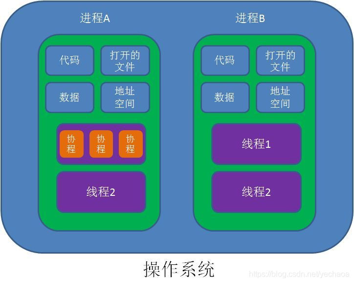

- [一、协程是什么](#一协程是什么)
		- [1.简介](#1简介)
		- [2.协程好在哪](#2协程好在哪)
		- [3.协程具体怎么用](#3协程具体怎么用)
			- [a.添加依赖](#a添加依赖)
			- [b.开始使用](#b开始使用)
			- [c.suspend](#csuspend)
		- [4.小结](#4小结)
- [二、挂起是什么](#二挂起是什么)
		- [1.「挂起」的本质](#1挂起的本质)
			- [线程：](#线程)
			- [协程：](#协程)
		- [2.怎么就「挂起」了？](#2怎么就挂起了)
		- [3.suspend 的意义？](#3suspend-的意义)
		- [4.怎么自定义 suspend 函数？](#4怎么自定义-suspend-函数)
			- [a.什么时候需要自定义 suspend 函数](#a什么时候需要自定义-suspend-函数)
			- [a.具体该怎么写](#a具体该怎么写)
		- [5.小结](#5小结)
- [三、挂起的非阻塞式是怎么回事](#三挂起的非阻塞式是怎么回事)
		- [1.什么是「非阻塞式挂起」](#1什么是非阻塞式挂起)
		- [2.为什么要讲非阻塞式挂起](#2为什么要讲非阻塞式挂起)
		- [3.协程与线程](#3协程与线程)
				- [代码示例](#代码示例)
		- [4.小结](#4小结-1)
- [四、获取协程的返回值](#四获取协程的返回值)
		- [async / await](#async--await)
		- [suspendCoroutine](#suspendcoroutine)
- [五、总结](#五总结)
- [六、参考文献/原文](#六参考文献原文)

## 一、协程是什么

#### 1.简介

协程并不是 Kotlin 提出来的新概念，其他的一些编程语言，例如：Go、Python 等都可以在语言层面上实现协程，甚至是 Java，也可以通过使用扩展库来间接地支持协程。

「协程 Coroutines」源自 Simula 和 Modula-2 语言，这个术语早在 1958 年就被 Melvin Edward Conway 发明并用于构建汇编程序，说明`协程是一种编程思想`，并不局限于特定的语言。

当我们在了解`协程`的时候，不可避免的会跟`线程`、`进程`做比较做分析，下面来贴个图便于理解



从 `Android 开发者`的角度去理解它们的关系：

* 我们所有的代码都是跑在线程中的，而线程是跑在进程中的。
* 协程没有直接和操作系统关联，但它不是空中楼阁，它也是跑在线程中的，可以是单线程，也可以是多线程。
* 单线程中的协程总的执行时间并不会比不用协程少。
* Android 系统上，如果在主线程进行网络请求，会抛出`NetworkOnMainThreadException`，对于在主线程上的协程也不例外，这种场景使用协程还是要切线程的。

> 协程设计的初衷是为了解决并发问题，让 「协作式多任务」 实现起来更加方便。

协程就是 Kotlin 提供的一套线程封装的 API，但并不是说协程就是为线程而生的。

不过，我们学习 Kotlin 中的协程，一开始确实可以从线程控制的角度来切入。因为在 Kotlin 中，协程的一个典型的使用场景就是线程控制。就像 Java 中的`Executor` 和 Android 中的`AsyncTask`，Kotlin 中的协程也有对 Thread API 的封装，让我们可以在写代码时，不用关注多线程就能够很方便地写出并发操作。

下面的例子是使用协程进行网络请求获取用户信息并显示到 UI 控件上：

```javascript
launch({
    val user = api.getUser() // 网络请求（IO 线程）
    nameTv.text = user.name  // 更新 UI（主线程）
})
```

这里只是展示了一个代码片段，`launch`并不是一个顶层函数，它必须在一个对象中使用，launch 函数加上实现在 {} 中具体的逻辑，就构成了一个协程。

通常我们做网络请求，要不就传一个 callback，要不就是在 IO 线程里进行阻塞式的同步调用，而在这段代码中，上下两个语句分别工作在两个线程里，但写法上看起来和普通的单线程代码一样。

这里的`api.getUser`是一个`挂起函数`，所以能够保证`nameTv.text`的正确赋值，这就涉及到了协程中最著名的「非阻塞式挂起」。这个名词看起来不是那么容易理解，后面会讲。现在先把这个概念放下，只需要记住协程就是这样写的就行了。

这种「用同步的方式写异步的代码」看起来很方便吧，那么我们来看看协程具体好在哪。

#### 2.协程好在哪

前面提到，launch 函数不是顶层函数，是不能直接用的，可以使用下面三种方法来创建协程：

```javascript
// 方法一，使用 runBlocking 顶层函数
runBlocking {
    getImage(imageId)
}
​
// 方法二，使用 GlobalScope 单例对象
//            可以直接调用 launch 开启协程
GlobalScope.launch {
    getImage(imageId)
}
​
// 方法三，自行通过 CoroutineContext 创建一个 CoroutineScope 对象
//                                    需要一个类型为 CoroutineContext 的参数
val coroutineScope = CoroutineScope(context)
coroutineScope.launch {
    getImage(imageId)
}
```

* 方法一通常适用于单元测试的场景，而业务开发中不会用到这种方法，因为它是线程阻塞的。
* 方法二和使用 runBlocking 的区别在于不会阻塞线程。但在 Android 开发中同样不推荐这种用法，因为它的生命周期会和 app 一致，且不能取消（什么是协程的取消后面会讲）。
* 方法三是比较推荐的使用方法，我们可以通过 context 参数去管理和控制协程的生命周期（这里的 context 和 Android 里的不是一个东西，是一个更通用的概念，会有一个 Android 平台的封装来配合使用）。

协程最常用的功能是并发，而并发的典型场景就是多线程。可以使用 `Dispatchers.IO`参数把任务切到 IO 线程执行：

```javascript
CoroutineScope(Dispatchers.IO).launch {
    ...
}
```


也可以使用 `Dispatchers.Main` 参数切换到主线程：

```javascript
CoroutineScope(Dispatchers.Main).launch{
    ...
}
```

所以在「协程是什么」一节中讲到的异步请求的例子完整写出来是这样的：

```javascript
CoroutineScope(Dispatchers.Main).launch{   // 在主线程开启协程
    val user = api.getUser() // IO 线程执行网络请求
    nameTv.text = user.name  // 主线程更新 UI
}
```

而通过 Java 实现以上逻辑，我们通常需要这样写：

```javascript
api.getUser(new Callback<User>() {
    @Override
    public void success(User user) {
        runOnUiThread(new Runnable() {
            @Override
            public void run() {
                nameTv.setText(user.name);
            }
        })
    }
    
    @Override
    public void failure(Exception e) {
        ...
    }
});
```

这种回调式的写法，打破了代码的顺序结构和完整性，读起来相当难受。
#### 3.协程具体怎么用

##### a.添加依赖

```javascript
    //依赖协程核心库
    implementation 'org.jetbrains.kotlinx:kotlinx-coroutines-core:1.3.5'
    //依赖当前平台所对应的平台库
    implementation 'org.jetbrains.kotlinx:kotlinx-coroutines-android:1.3.5'
```


Kotlin 协程是以官方扩展库的形式进行支持的。我们所使用的「核心库」和 「平台库」的版本应该保持一致。

* 核心库中包含的代码主要是协程的公共 API 部分。有了这一层公共代码，才使得协程在各个平台上的接口得到统一。
* 平台库中包含的代码主要是协程框架在具体平台的具体实现方式。因为多线程在各个平台的实现方式是有所差异- 的。

##### b.开始使用

协程最简单的使用方法，其实在前面章节就已经看到了。我们可以通过一个 `launch`函数实现线程切换的功能：

```javascript
CoroutineScope(Dispatchers.IO).launch {
    ...
}
```

这个 launch 函数，它具体的含义是：我要创建一个新的协程，并在指定的线程上运行它。这个被创建、被运行的所谓「协程」是谁？就是你传给 launch 的那些代码，这一段连续代码叫做一个「协程」。

所以，什么时候用协程？当你需要切线程或者指定线程的时候。你要在后台执行任务？切！

```javascript
launch(Dispatchers.IO) {
    val image = getImage(imageId)
}
```

然后需要在前台更新界面？再切！

```javascript
CoroutineScope(Dispatchers.IO).launch{
    val image = getImage(imageId)
    launch(Dispatch.Main) {
        avatarIv.setImageBitmap(image)
    }
}
```

好像有点不对劲，这不还是有嵌套嘛。

如果只是使用 launch 函数，协程并不能比线程做更多的事。不过协程中却有一个很实用的函数：`withContext` 。这个函数可以切换到指定的线程，并在闭包内的逻辑执行结束之后，自动把线程切回去继续执行。那么可以将上面的代码写成这样：

```javascript
CoroutineScope(Dispatchers.Main).launch {      // 在 UI 线程开始
    val image = withContext(Dispatchers.IO) {  // 切换到 IO 线程，并在执行完成后切回 UI 线程
        getImage(imageId)                      // 将会运行在 IO 线程
    }
    avatarIv.setImageBitmap(image)             // 回到 UI 线程更新 UI
} 
```

这种写法看上去好像和刚才那种区别不大，但如果你需要频繁地进行线程切换，这种写法的优势就会体现出来。可以参考下面的对比：

```javascript
// 第一种写法
CoroutineScope(Dispatchers.IO).launch {
    ...
    launch(Dispachers.Main){
        ...
        launch(Dispachers.IO) {
            ...
            launch(Dispacher.Main) {
                ...
            }
        }
    }
}
​
// 通过第二种写法来实现相同的逻辑
CoroutineScope(Dispatchers.Main).launch{
    ...
    withContext(Dispachers.IO) {
        ...
    }
    ...
    withContext(Dispachers.IO) {
        ...
    }
    ...
}
```

由于可以"自动切回来"，消除了并发代码在协作时的嵌套。由于消除了嵌套关系，我们甚至可以把 `withContext` 放进一个单独的函数里面：

```javascript
launch(Dispachers.Main) {              // 在 UI 线程开始
    val image = getImage(imageId)
    avatarIv.setImageBitmap(image)     // 执行结束后，自动切换回 UI 线程
}
//                               👇
fun getImage(imageId: Int) = withContext(Dispatchers.IO) {
    ...
}
```

这就是之前说的「用同步的方式写异步的代码」了。

不过如果只是这样写，编译器是会报错的：

```javascript
fun getImage(imageId: Int) = withContext(Dispatchers.IO) {
    // IDE 报错 Suspend function'withContext' should be called only from a coroutine or another suspend funcion
}
```

意思是说，withContext 是一个 `suspend`函数，它需要在协程或者是另一个 `suspend`函数中调用。

##### c.suspend

`suspend`是 Kotlin 协程最核心的关键字，几乎所有介绍 Kotlin 协程的文章和演讲都会提到它。它的中文意思是「暂停」或者「可挂起」。如果你去看一些技术博客或官方文档的时候，大概可以了解到：「代码执行到 `suspend` 函数的时候会『挂起』，并且这个『挂起』是非阻塞式的，它不会阻塞你当前的线程。」

上面报错的代码，其实只需要在前面加一个`suspend` 就能够编译通过：

```javascript
suspend fun getImage(imageId: Int) = withContext(Dispatchers.IO) {
    ...
}
```

而`suspend`具体是什么，下面介绍。

#### 4.小结

协程是一种编程思想，写法简洁，可以通过Dispatchers调度器切换到指定的线程。所有代码都是运行在线程中的，协程也是。

## 二、挂起是什么

#### 1.「挂起」的本质

协程中「挂起」的对象到底是什么？挂起线程，还是挂起函数？都不对，我们挂起的对象是协程。

launch ，async 或者其他函数创建的协程，在执行到某一个 suspend 函数的时候，这个协程会被「suspend」，也就是被挂起。

那此时又是从哪里挂起？从当前线程挂起。换句话说，就是这个协程从正在执行它的线程上脱离。

注意，不是这个协程停下来了！是脱离，当前线程不再管这个协程要去做什么了。

suspend 是有暂停的意思，但我们在协程中应该理解为：当线程执行到协程的 suspend 函数的时候，暂时不继续执行协程代码了。

我们先让时间静止，然后兵分两路，分别看看这两个互相脱离的线程和协程接下来将会发生什么事情：

##### 线程：

前面我们提到，挂起会让协程从正在执行它的线程上脱离，具体到代码其实是：

协程的代码块中，线程执行到了 suspend 函数这里的时候，就暂时不再执行剩余的协程代码，跳出协程的代码块。

那线程接下来会做什么呢？

如果它是一个后台线程：

* 要么无事可做，被系统回收
* 要么继续执行别的后台任务

跟 Java 线程池里的线程在工作结束之后是完全一样的：回收或者再利用。

如果这个线程它是 Android 的主线程，那它接下来就会继续回去工作：也就是一秒钟 60 次的界面刷新任务。

##### 协程：

线程的代码在到达`suspend`函数的时候被掐断，接下来协程会从这个`suspend` 函数开始继续往下执行，不过是在`指定的线程`。

谁指定的？是 suspend 函数指定的，比如函数内部的 `withContext` 传入的`Dispatchers.IO`所指定的 IO 线程。

Dispatchers 调度器，它可以将协程限制在一个特定的线程执行，或者将它分派到一个线程池，或者让它不受限制地运行。

常用的`Dispatchers` ，有以下三种：

* Dispatchers.Main：Android 中的主线程
* Dispatchers.IO：针对磁盘和网络 IO 进行了优化，适合 IO 密集型的任务，比如：读写文件，操作[数据库](https://cloud.tencent.com/solution/database?from_column=20065\&from=20065)以及网络请求
* Dispatchers.Default：适合 CPU 密集型的任务，比如计算

回到我们的协程，它从`suspend`函数开始脱离启动它的线程，继续执行在 `Dispatchers`所指定的 IO 线程。

紧接着在 suspend 函数执行完成之后，协程为我们做的最爽的事就来了：会`自动帮我们把线程再切回来`。

这个「切回来」是什么意思？

我们的协程原本是运行在主线程的，当代码遇到`suspend`函数的时候，发生线程切换，根据 `Dispatchers` 切换到了 IO 线程；

当这个函数执行完毕后，线程又切了回来，「切回来」也就是协程会帮我再 `post`一个 `Runnable`，让我剩下的代码继续回到主线程去执行。

ok，我们从线程和协程的两个角度都分析完成后，终于可以对协程的「挂起」suspend 做一个解释：

协程在执行到有 suspend 标记的函数的时候，会被 suspend 也就是被挂起，而所谓的被挂起，就是切个线程；

不过区别在于，挂起函数在执行完成之后，协程会重新切回它原先的线程。

再简单来讲，在 Kotlin 中所谓的挂起，就是一个稍后会被自动切回来的线程调度操作。

> 这个「切回来」的动作，在 Kotlin 里叫做 resume，恢复。

通过刚才的分析我们知道：挂起之后是需要恢复。

而恢复这个功能是协程的，如果你不在协程里面调用，恢复这个功能没法实现，所以也就回答了这个问题：为什么挂起函数必须在协程或者另一个挂起函数里被调用。

因为 一个挂起函数要么在协程里被调用，要么在另一个挂起函数里被调用，所以不管是直接还是间接地，总是会在一个协程里被调用的。

当然，要求 suspend 函数只能在协程里或者另一个 suspend 函数里被调用，还是为了要让协程能够在 suspend 函数切换线程之后再切回来。

#### 2.怎么就「挂起」了

我们了解到了什么是「挂起」后，再接着看看这个「挂起」是怎么做到的。

先随便写一个自定义的 `suspend`函数：

```javascript
suspend fun suspendingPrint() {
  println("Thread: ${Thread.currentThread().name}")
}

I/System.out: Thread: main
```

输出的结果还是在主线程。

为什么没切换线程？因为它不知道往哪切，需要我们告诉它。

比如例子中 `suspendingGetImage` 函数代码：

```javascript
//                                               👇
suspend fun suspendingGetImage(id: String) = withContext(Dispatchers.IO) {
  ...
}
```

我们可以发现不同之处其实在于 `withContext`函数。

其实通过 `withContext`源码可以知道，它本身就是一个挂起函数，它接收一个 `Dispatcher`参数，依赖这个 Dispatcher 参数的指示，你的协程被挂起，然后切到别的线程。

所以这个 suspend，其实并不是起到把任何把协程挂起，或者说切换线程的作用。

真正挂起协程这件事，是 Kotlin 的协程框架帮我们做的。

所以我们想要自己写一个挂起函数，仅仅只加上 suspend 关键字是不行的，还需要函数内部直接或间接地调用到 Kotlin 协程框架自带的 suspend 函数才行。

#### 3.suspend 的意义？

这个 suspend 关键字，既然它并不是真正实现挂起，那它的作用是什么？

**它其实是一个提醒。**

函数的创建者对函数的使用者的提醒：我是一个耗时函数，我被我的创建者用挂起的方式放在后台运行，所以请在协程里调用我。

为什么 `suspend`关键字并没有实际去操作挂起，但 Kotlin 却把它提供出来？

因为它本来就不是用来操作挂起的。

挂起的操作 —— 也就是切线程，依赖的是挂起函数里面的实际代码，而不是这个关键字。

所以这个关键字，只是一个提醒。

还记得刚才我们尝试自定义挂起函数的方法吗？

```javascript
// redundant suspend modifier
suspend fun suspendingPrint() {
  println("Thread: ${Thread.currentThread().name}")
}
```

如果你创建一个 suspend 函数但它内部不包含真正的挂起逻辑，编译器会给你一个提醒：redundant suspend modifier，告诉你这个`suspend`是多余的。

因为你这个函数实质上并没有发生挂起，那你这个 suspend 关键字只有一个效果：就是限制这个函数只能在协程里被调用，如果在非协程的代码中调用，就会编译不通过。

所以，创建一个 suspend 函数，为了让它包含真正挂起的逻辑，要在它内部直接或间接调用 Kotlin 自带的 suspend 函数，你的这个 `suspend`才是有意义的。

#### 4.怎么自定义 suspend 函数？

在了解了 suspend 关键字的来龙去脉之后，我们就可以进入下一个话题了：怎么自定义 suspend 函数。

这个「怎么自定义」其实分为两个问题：

* 什么时候需要自定义 suspend 函数？
* 具体该怎么写呢？

##### a.什么时候需要自定义 suspend 函数

如果你的某个函数比较耗时，也就是要等的操作，那就把它写成 suspend 函数。这就是原则。

耗时操作一般分为两类：I/O 操作和 CPU 计算工作。比如文件的读写、网络交互、图片的模糊处理，都是耗时的，通通可以把它们写进 suspend 函数里。

另外这个「耗时」还有一种特殊情况，就是这件事本身做起来并不慢，但它需要等待，比如 5 秒钟之后再做这个操作。这种也是 suspend 函数的应用场景。

##### a.具体该怎么写

给函数加上 suspend 关键字，然后在 withContext 把函数的内容包住就可以了。

提到用 withContext是因为它在挂起函数里功能最简单直接：把线程自动切走和切回。

当然并不是只有 withContext 这一个函数来辅助我们实现自定义的 suspend 函数，比如还有一个挂起函数叫 delay，它的作用是等待一段时间后再继续往下执行代码。

使用它就可以实现刚才提到的等待类型的耗时操作：

```javascript
suspend fun suspendUntilDone() {
  while (!done) {
    delay(5)
  }
}
```

这些东西，在我们初步使用协程的时候不用立马接触，可以先把协程最基本的方法和概念理清楚。

#### 5.小结

这一部分主要讲的是挂起，这个挂起对象就是协程，是一段代码块。 挂起其实就是切换线程，而协程还可以再帮我们切回来。

## 三、挂起的非阻塞式是怎么回事

#### 1.什么是「非阻塞式挂起」

非阻塞式是相对阻塞式而言的。

线程阻塞很好理解，现实中的例子就是交通堵塞，它的核心有 3 点：

* 前面有障碍物，你过不去（线程卡了）
* 需要等障碍物清除后才能过去（耗时任务结束）
* 除非你绕道而行（切到别的线程）

从语义上理解「非阻塞式挂起」，讲的是「非阻塞式」这个是挂起的一个特点，也就是说，协程的挂起，就是非阻塞式的，协程是不讲「阻塞式的挂起」的概念的。

我们讲「非阻塞式挂起」，其实它有几个前提：并没有限定在一个线程里说这件事，因为挂起这件事，本来就是涉及到多线程。

阻塞不阻塞，都是针对单线程讲的，一旦切了线程，肯定是非阻塞的，你都跑到别的线程了，之前的线程就自由了，可以继续做别的事情了。

所以「非阻塞式挂起」，其实就是在讲协程在挂起的同时切线程这件事情。

「非阻塞式挂起」指的就是协程在挂起的同时切线程这件事情。使用了协程的代码看似阻塞，但由于协程内部做了很多工作（包括自动切换线程），它实际上是非阻塞的。在代码执行的过程中，线程虽然会切换，但写法上类似普通的单线程代码。\
在 Kotlin 中，协程就是基于线程来实现的一种更上层的工具 API，类似于 Android 自带的 Handler 系列 API。在设计思想上，协程是一个基于线程的上层框架。Kotlin 协程并没有脱离 Kotlin 或者 JVM 创造新的东西，只是简化了多线程的开发。

#### 2.为什么要讲非阻塞式挂起

协程只是在写法上「看起来阻塞」，其实是「非阻塞」的，因为在协程里面它做了很多工作，其中有一个就是帮我们切线程。

让我们来看看下面的例子：

```javascript
main {
    CoroutineScope(Dispatchers.Main).launch {
        // 耗时操作
        val user = suspendingRequestUser()
        updateView(user)
    }
    
    private suspend fun suspendingRequestUser() : User = withContext(Dispatchers.IO) {
        api.requestUser()
    }
}
```

从上面的例子可以看到，耗时操作和更新 UI 的逻辑像写单线程一样放在了一起，只是在外面包了一层协程。

而正是这个协程解决了原来我们单线程写法会卡线程这件事。

#### 3.协程与线程

在 Kotlin 里，协程就是基于线程来实现的一种更上层的工具 API，类似于 Java 自带的 Executor 系列 API 或者 Android 的 Handler 系列 API。

只不过呢，协程它不仅提供了方便的 API，在设计思想上是一个`基于线程的上层框架`，你可以理解为新造了一些概念用来帮助你更好地使用这些 API，仅此而已。

就像 ReactiveX 一样，为了让你更好地使用各种操作符 API，新造了 Observable 等概念。

###### []()代码示例

使用协程模拟实现一个网络请求，等待时显示 Loading，请求成功或者出错让 Loading 消失，并将状态反馈给用户。\
在 ViewModel 中编写如下业务逻辑代码：

```Kotlin
@HiltViewModel
class MainViewModel @Inject constructor() : ViewModel() {
    enum class RequestStatus {
        IDLE, LOADING, SUCCESS, FAIL
    }
    
    val requestStatus = MutableStateFlow(RequestStatus.IDLE)
    
    /**
     * 模拟网络请求，并将状态设置给 requestStatus 变量
     */
    fun simulateNetworkRequest() {
        requestStatus.value = RequestStatus.LOADING
        viewModelScope.launch {
            val requestResult = async { performSimulatedRequest() }.await()
            requestStatus.value = if (requestResult) RequestStatus.SUCCESS else RequestStatus.FAIL
        }
    }
    
    /**
     * 使用 delay 方法模拟耗时操作，用随机数模拟请求成功或失败
     */
    private suspend fun performSimulatedRequest() = withContext(Dispatchers.IO) {
        delay(500)
        val random = Random()
        return@withContext random.nextBoolean()
    }
}
```

MainActivity 中使用 Jetpack Compose，将请求状态实时显示在界面上：

```Kotlin
@AndroidEntryPoint
class MainActivity : ComponentActivity() {
    private val mainViewModel: MainViewModel by viewModels()
 
    override fun onCreate(savedInstanceState: Bundle?) {
        super.onCreate(savedInstanceState)
        setContent {
            ComposeTheme {
                Surface(modifier = Modifier.fillMaxSize(), color = MaterialTheme.colorScheme.background) {
                    val requestStatusState = mainViewModel.requestStatus.collectAsState()
                    val requestStatus by rememberSaveable { requestStatusState }
                    
                    Text(
                        text = requestStatus.name,
                        color = Color.Red
                    )
                }
            }
        }
        mainViewModel.simulateNetworkRequest()
    }
}
```
#### 4.小结

这一部分主要讲的是非阻塞式挂起，挂起其实是切换线程，就是脱离了原来的线程，原来的线程该干嘛干嘛了，所以是非阻塞式挂起。

## 四、获取协程的返回值

协程是一种异步的概念，需要一些特殊操作才能获取返回值。获取协程的返回值可以使用以下方式：

#### []()async / await

主要流程是使用 async 开启协程，然后调用 async 返回的 Deferred 对象的 await 方法获取协程运算的结果：

```Kotlin
coroutineScope.launch(Dispatchers.IO) {
    val job = async {
        delay(1000)
        return@async "return value"
    }
    println("async result=${job.await()}")
}
```

#### []()suspendCoroutine

与 async 不同，suspendCoroutine 只是一个挂起方法，无法开启协程，需要在其他协程作用域中使用。协程运行结束后，使用 resume 提交返回值或使用 resumeWithException 抛出异常。

```Kotlin
coroutineScope.launch(Dispatchers.IO) {
    try {
        val result = suspendCoroutine<String> {
            delay(1000)
            val random = Random().nextBoolean()
            if (random) {
                it.resume("return value")
            } else {
                it.resumeWithException(Exception("Coroutine Failure"))
            }
        }
        println("suspendCoroutine success result: $result")
    } catch (e: java.lang.Exception) {
        println("suspendCoroutine failure exception: $e")
    }
}
```


## 五、总结

* 协程就是切线程；
* 挂起就是可以自动切回来的切线程；
* 挂起的非阻塞式指的是它能用看起来阻塞的代码写出非阻塞的操作，就这么简单。

## 六、参考文献/原文
https://cloud.tencent.com/developer/article/2019959
https://blog.csdn.net/qq_39312146/article/details/130957738