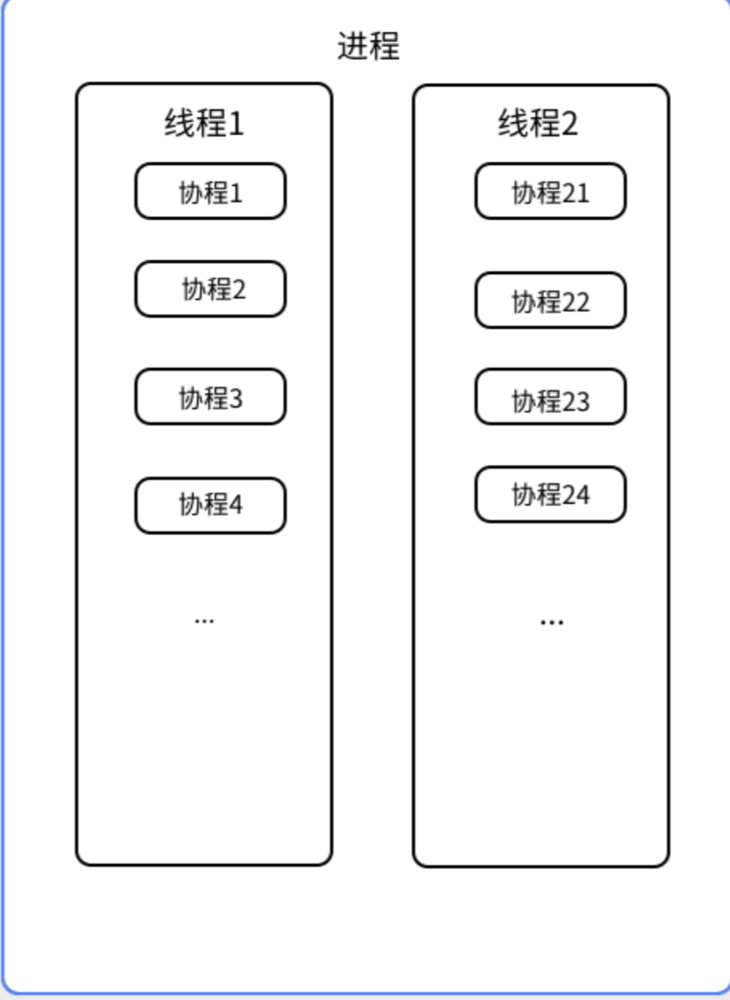

- [参考文献/原文](#参考文献原文)

# 一.kotlin协程的理解

<p>
协程并不是一个新的概念，而是一个非常老的概念，很多语言都支持协程，建议去浏览器去了解一下协程的历史和基本概念，这里我们只讲一下kotlin中的协程的作用。
</p>

**从代码实现角度来看：kotlin协程底层是用线程实现的，是一个封装完善供开发者使用的线程框架。kotlin的一个协程可以理解为是运行在线程上的一个执行任务并且该任务可以在不同的线程间切换，一个线程可以同时运行多个协程**

概念图如下：一个线程可以同时运行多个协程（执行任务），如果有需要，线程1上的协程可以切换到线程2上去运行。反应在我们Android开发中，就是我们的网络请求数据库操作等耗时任务时运行在IO线程的，当我们获取到数据以后更新页面的操作是运行在主线程的\


**从开发者角度来看：kotlin协程可以实现以同步的方式去编写异步执行的代码，解决线程切换回调的嵌套地狱**。协程挂起时不需要阻塞线程，几乎是无代价的。
反应到我们Android开发就是，以前我们在IO线程拿到数据后，想回到主线程更新UI,我们一般会使用Handler或者CallBack接口回调等方式，这样做的结果是当我们连续进行上述操作后很容易陷入嵌套地狱，严重影响代码阅读性和美观。

## 二. 协程的创建方式

我们想在Android Studio中使用协程，除了引入kotlin支持外，我们还要引入两个协程支持库

```kotlin
// 协程核心库
implementation "org.jetbrains.kotlinx:kotlinx-coroutines-core:1.5.1"
// 协程Android支持库
implementation "org.jetbrains.kotlinx:kotlinx-coroutines-android:1.5.1"
```

**创建协程的方式**

##### []()2.1.） runBlocking:这是一个顶层函数，会启动一个新的协程并阻塞调用它的线程，直到里面的代码执行完毕,返回值是泛型T。

```kotlin
public fun <T> runBlocking(context: CoroutineContext = EmptyCoroutineContext, block: suspend CoroutineScope.() -> T): T
```

##### []()2.2） CoroutineScope.launch ：通过一个协程作用域的扩展方法launch启动一个协程，不会阻塞调用它的线程，返回值是Job。

```kotlin
public fun CoroutineScope.launch(
    context: CoroutineContext = EmptyCoroutineContext,
    start: CoroutineStart = CoroutineStart.DEFAULT,
    block: suspend CoroutineScope.() -> Unit
): Job
```

##### []()2.3） CoroutineScope.async ：通过一个协程作用域的扩展方法async启动一个协程，不会阻塞调用它的线程，返回值是 Deferred。

```kotlin
public fun <T> CoroutineScope.async(
    context: CoroutineContext = EmptyCoroutineContext,
    start: CoroutineStart = CoroutineStart.DEFAULT,
    block: suspend CoroutineScope.() -> T
): Deferred<T>
```

我们一般使用2）3）两种方式开启一个协程，1）方式因为会阻塞线程，所以runBlocking函数我们在开发中基本不会使用到，但可以用于代码调试。\
提前说一下async和launch的区别，后面会讲到并有示例：\
返回值不同：async函数体中最后一行代码表达式运行结果会作为结果返回，也就是Deferred中的泛型T,我们可以通过其他协程函数获取到这个执行结果，而launch没有这样的返回值。

示例代码：GlobalScope是一个协程库中已经提供的协程作用域

```kotlin
runBlocking {
    Log.e("协程","我们使用runBlocking启动了一个协程")
}
GlobalScope.launch {
    Log.e("协程","我们使用launch启动了一个协程")
}
GlobalScope.async {
    Log.e("协程","我们使用async启动了一个协程")
}
```

## []()[]()三. 协程作用域与协程上下文

我们前面提到创建协程的三种方式中有launch和async方式都需要使用协程作用域开启一个协程

##### []()3.1 什么是协程作用域？

**协程作用域CoroutineScope是协程的运行范围。**\
如下：**CoroutineScope是一个接口，只有一个接口属性CoroutineContext 协程上下文，所以CoroutineScope其实是CoroutineContext协程上下文的封装。**

```kotlin
public interface CoroutineScope {
    public val coroutineContext: CoroutineContext
}
```

#### []()[]()3.2 什么是协程上下文？

**CoroutineContext代表协程的上下文**，我们在理解协程上下文之前，我们先理解一下Context上下文，Android开发者应该对这个再属性不过了，我们的Application、Activity等都被定义成了一个Context。那我们怎么理解这个Context上下文呢？好比我们上学考试的时候进行阅读理解，我们要理解一段话的含义，我们应该怎么办，需要代入原文章，然后看看前面看看后面是怎么回事我们才能懂。代入代码中，我们运行到这段代码了，我们也需要了解一下这段代码该怎么执行，需要什么信息才能执行，这些信息就保存在Context中，我们可以把Context理解为一个容器，用于保存代码执行所需要的配置信息。所以**CoroutineContext就是我们启动一个协程需要的配置信息。**

我们看一下CoroutineContext的源码实现，是一个接口，该接口内部有一个内部接口Element（该接口继承自CoroutineContext，Element接口有一个key，类似于键值对，我们可以用key判断Element）\
我们看到我们可以对CoroutineContext执行 get（根据key获取某个CoroutineContext）、plus（一个加号操作符重载返回值是CoroutineContext，这就意味着CoroutineContext+CoroutineContext =CoroutineContext ）、minusKey（去掉key对应的CoroutineContext）等操作，看着真像是一个集合操作，其实CoroutineContext就类似于一个集合操作，所以我们可以猜想一下CoroutineContext有很多的子类，这些子类可以相加拼接，minusKey相减构成多样性的CoroutineContext。

```kotlin
public interface CoroutineContext {

    public operator fun <E : Element> get(key: Key<E>): E?

    public fun <R> fold(initial: R, operation: (R, Element) -> R): R

    public operator fun plus(context: CoroutineContext): CoroutineContext =
        if (context === EmptyCoroutineContext) this else 
            context.fold(this) { acc, element ->
                val removed = acc.minusKey(element.key)
                if (removed === EmptyCoroutineContext) element else {
    
                    val interceptor = removed[ContinuationInterceptor]
                    if (interceptor == null) CombinedContext(removed, element) else {
                        val left = removed.minusKey(ContinuationInterceptor)
                        if (left === EmptyCoroutineContext) CombinedContext(element, interceptor) else
                            CombinedContext(CombinedContext(left, element), interceptor)
                    }
                }
            }

    public fun minusKey(key: Key<*>): CoroutineContext

    public interface Key<E : Element>

    public interface Element : CoroutineContext {

        public val key: Key<*>

        public override operator fun <E : Element> get(key: Key<E>): E? 
            @Suppress("UNCHECKED_CAST")
            if (this.key == key) this as E else null

        public override fun <R> fold(initial: R, operation: (R, Element) -> R): R =
            operation(initial, this)

        public override fun minusKey(key: Key<*>): CoroutineContext =
            if (this.key == key) EmptyCoroutineContext else this
    }
}
```

##### []()3.3 协程作用域与子协程

**我们可以在一个协程中开启另一个协程，这样开启的协程就是子协程。**\
需要注意的有两点：\
**1.）子协程的协程作用域会继承父协程协程作用域里的 协程上下文\
2.）如果父协程取消了，所有的子协程也会被取消**\
我们会在下面依次验证这两个注意点。

##### []()3.4 CoroutineContext的那些子类

CoroutineContext有很多子类，这些子类各自有不同的的作用，并且共同构成了协程作用域里的CoroutineContext。\
我们先打印一下一个协程作用域的的coroutineContext，看打印出来是什么

```kotlin
GlobalScope.launch{
    Log.e("协程的coroutineContext",this.coroutineContext.toString())
}
打印结果：
[StandaloneCoroutine{Active}@5a7652d, Dispatchers.Default]
```

我们一一了解这些子类，并且了解他们对协程的影响和作用

##### []()3.4.1 )CoroutineDispatcher 协程调度器

我们知道协程运行在线程，并且可以切换到其他线程，CoroutineDispatcher确定了相关的协程在哪个线程或哪些线程上执行，所以也可以把CoroutineDispatcher叫做协程的线程调度器。

```kotlin
public abstract class CoroutineDispatcher :
    AbstractCoroutineContextElement(ContinuationInterceptor), ContinuationInterceptor {

    @ExperimentalStdlibApi
    public companion object Key : AbstractCoroutineContextKey<ContinuationInterceptor, CoroutineDispatcher>(
        ContinuationInterceptor,
        { it as? CoroutineDispatcher })
}
```

kotlin给我们提供了四种调度器

```kotlin
public actual object Dispatchers {
public actual val Default: CoroutineDispatcher = createDefaultDispatcher()
public actual val Main: MainCoroutineDispatcher get() = MainDispatcherLoader.dispatcher
public actual val Unconfined: CoroutineDispatcher = kotlinx.coroutines.Unconfined
public val IO: CoroutineDispatcher = DefaultScheduler.IO
}
```

**Default：默认调度器，CPU密集型任务调度器，通常处理一些单纯的计算任务，或者执行时间较短任务。例如数据计算\
IO：IO调度器，IO密集型任务调度器，适合执行IO相关操作。比如：网络请求，数据库操作，文件操作等\
Main：UI调度器，只有在UI编程平台上有意义，用于更新UI,例如Android中的主线程
Unconfined：非受限调度器，无所谓调度器，当前协程可以运行在任意线程上**
我们通过上面的打印可以知道，GlobalScope的协程调度器是Dispatchers.Default，那么我们如何改变呢？我们前面查看launch和async方法时，看到他们的第一个参数都是context: CoroutineContext ，是的，我们可以从这里传入我们需要的上下文，并且会覆盖掉协程作用域里的上下文。
如下：我们希望开启一个协程运行在IO线程上

```kotlin
GlobalScope.launch(Dispatchers.IO){
    Log.e("协程的coroutineContext",this.coroutineContext.toString())
}
打印结果：
[StandaloneCoroutine{Active}@db90566, Dispatchers.IO]
```

那如果我们想在协程运行中改变线程怎么办，最常见的，网络请求在IO线程，而页面更新在主线程。kotlin给我们提供了一个顶层函数withContext用于改变协程的上下文并执行一段代码。

```kotlin
public suspend fun <T> withContext(
    context: CoroutineContext,
    block: suspend CoroutineScope.() -> T
): T 
```

示例代码：

```kotlin
GlobalScope.launch(Dispatchers.Main) {
    val result = withContext(Dispatchers.IO) {
        //网络请求
        "返回结果"
    }
    mBtn.text = result
}
```

##### []()3.4.2 )CoroutineName 协程名称

协程名称：顾名思义，就是给协程取个名字，这个没有什么好说的，就是用来更好的区分协程的。

```kotlin
public data class CoroutineName(

    val name: String
) : AbstractCoroutineContextElement(CoroutineName) {

    public companion object Key : CoroutineContext.Key<CoroutineName>

    override fun toString(): String = "CoroutineName($name)"
}
```

示例代码：

```kotlin
GlobalScope.launch(Dispatchers.Main + CoroutineName("主协程")) {
    Log.e("协程的coroutineContext",this.coroutineContext.toString())
}
打印结果：
[CoroutineName(主协程), StandaloneCoroutine{Active}@288ff9, Dispatchers.Main]
```

我们使用协程名称验证子协程的第一个注意点：子协程的协程作用域会继承父协程协程作用域里的 协程上下文
我们在上述代码中开启一个子协程：

```kotlin
GlobalScope.launch(Dispatchers.Main + CoroutineName("主协程")) {
    Log.e("协程的coroutineContext" , this.coroutineContext.toString())
    launch {
        Log.e("协程的coroutineContext2" , this.coroutineContext.toString())
    }
}
```

打印结果如下：可以看到，子协程竟然打印出了和父协程相同的CoroutineName，说明父协程的协程上下文传播到了子协程

```kotlin
协程的coroutineContext: [CoroutineName(主协程), StandaloneCoroutine{Active}@288ff9, Dispatchers.Main]
协程的coroutineContext2: [CoroutineName(主协程), StandaloneCoroutine{Active}@b95b3e, Dispatchers.Main]
```

我们稍微改一下代码：

```kotlin
GlobalScope.launch(Dispatchers.Main + CoroutineName("主协程")) {
    Log.e("协程的coroutineContext" , this.coroutineContext.toString())
    launch(CoroutineName("子协程")) {
        Log.e("协程的coroutineContext2" , this.coroutineContext.toString())
    }
}
```

打印结果如下：子协程设置的协程上下文覆盖掉了从父协程处继承的上下文

```kotlin
协程的coroutineContext: [CoroutineName(主协程), StandaloneCoroutine{Active}@288ff9, Dispatchers.Main]
协程的coroutineContext2: [CoroutineName(子协程), StandaloneCoroutine{Active}@8aced9f, Dispatchers.Main]
```

##### []()3.4.3）Job与协程的生命周期

我们前面在查看launch和async两个扩展函数时，可以看到launch返回结果是一个Job,而async的返回结果是一个Deferred，Deferred其实是Job的子类。

```kotlin
public interface Job : CoroutineContext.Element 
public interface Deferred<out T> : Job 
```

那么Job是什么呢？\
**协程启动以后，我们可以得到一个Job对象，通过Job对象我们可以检测协程的生命周期状态，并且可以操作协程（比如取消协程）**。我们可以大致把Job理解为协程本身。\
**协程的生命周期：协程创建以后，处于New（新建）状态，协程启动（调用start()方法）以后，处于Active（活跃） 状态，协程及所有子协程完成任务以后，处于Completed（完成） 状态，协程被取消（调用cancel()方法）以后，处于Cancelled（取消） 状态**\
我们可以使用job下面的字段检查协程的状态：\
isActive 用于判断协程是否处于活跃状态，\
isCancelled 用于判断协程是否被取消\
isCompleted用于判断协程是否结束\
除了获取协程状态，还有很多可以用于操纵协程的函数，例如：\
cancel()取消协程。\
start()启动协程。\
await() 等待协程执行完成

我们验证一下协程的生命周期：

```kotlin
GlobalScope.launch {
    val job = launch(CoroutineName("子协程")) {

    }
    Log.e("子协程的状态","${job.isActive} ${job.isCancelled} ${job.isCompleted}")
    delay(1000)
    Log.e("子协程的状态2","${job.isActive} ${job.isCancelled} ${job.isCompleted}")
}
打印结果：
子协程的状态: true false false
子协程的状态2: false false true
```

```kotlin
GlobalScope.launch {
    val job = launch(CoroutineName("子协程")) {
        delay(5000)
    }
    Log.e("子协程的状态","${job.isActive} ${job.isCancelled} ${job.isCompleted}")
    job.cancel()
    Log.e("取消后子协程的状态","${job.isActive} ${job.isCancelled} ${job.isCompleted}")
}
打印结果：
子协程的状态: true false false
取消后子协程的状态: false true false
```

我们使用协程的生命周期验证一下子协程的第二个注意点：如果父协程取消了，所有的子协程也会被取消

```kotlin
var childJob : Job? = null
val parentJob = GlobalScope.launch {
    childJob = launch(CoroutineName("子协程")) {
        delay(5000)
    }
}
Log.e("父协程的状态" , "${parentJob.isActive} ${parentJob.isCancelled} ${parentJob.isCompleted}")
Handler().postDelayed(Runnable {
    Log.e("子协程的状态" ,
        "${childJob?.isActive} ${childJob?.isCancelled} ${childJob?.isCompleted}")
    parentJob.cancel()
    Log.e("父协程的状态" ,
        "${parentJob.isActive} ${parentJob.isCancelled} ${parentJob.isCompleted}")
    Log.e("子协程的状态" ,
        "${childJob?.isActive} ${childJob?.isCancelled} ${childJob?.isCompleted}")
} , 1000)
打印结果如下：可以看到父协程取消以后，子协程也取消了。
父协程的状态: true false false
子协程的状态: true false false
父协程的状态: false true false
子协程的状态: false true false
```

##### []()3.4.4） CoroutineExceptionHandler 协程异常处理

我们在写代码的时候，肯定会遇到异常的情况，正常我们处理异常使用try …catch捕获，但难免会出现遗漏。CoroutineExceptionHandler 就是协程专门捕获异常的类，协程中出现的异常都会被捕获并由CoroutineExceptionHandler的handleException方法返回给我们进行处理。

```kotlin
public interface CoroutineExceptionHandler : CoroutineContext.Element {
    public companion object Key : CoroutineContext.Key<CoroutineExceptionHandler>

    public fun handleException(context: CoroutineContext, exception: Throwable)
}
```

handleException会返回两个参数，第一个参数是出现异常的协程，第二个参数是出现的异常。\
示例如下：我们手动抛出一个NullPointerException异常，然后创建一个CoroutineExceptionHandler赋给协程。

```kotlin
val exceptionHandler = CoroutineExceptionHandler { coroutineContext, throwable ->
    Log.e("捕获异常", "${coroutineContext[CoroutineName]} ：$throwable")
}

GlobalScope.launch(Dispatchers.Main + CoroutineName("主协程")+exceptionHandler) {
    Log.e("协程的coroutineContext",this.coroutineContext.toString())
    throw NullPointerException()
}
打印结果：
协程的coroutineContext: [CoroutineName(主协程), com.jf.simple.ThirdActivity$onCreate$$inlined$CoroutineExceptionHandler$1@288ff9, StandaloneCoroutine{Active}@b95b3e, Dispatchers.Main]

捕获异常: CoroutineName(主协程) ：java.lang.NullPointerException
```

##### []()3.4.5) ContinuationInterceptor 协程拦截器

```kotlin
public interface ContinuationInterceptor : CoroutineContext.Element {

    companion object Key : CoroutineContext.Key<ContinuationInterceptor>
}
```

顾名思义,是用来拦截协程的，因为涉及到挂起函数的原理，并且平时开发用到的相对较少，所以这里不展开。

## []()[]()四、协程的启动模式

我们在查看launch和async扩展函数时，还有第二个参数，start: CoroutineStart，这个参数的含义就是协程的启动模式，

```kotlin
public enum class CoroutineStart {
DEFAULT,
LAZY,
ATOMIC,
UNDISPATCHED;
}
```

可以看到CoroutineStart是一个枚举类，有四种类型。\
**DEFAULT默认启动模式，协程创建后立即开始调度，注意是立即调度而不是立即执行，可能在执行前被取消掉。\
LAZY懒汉启动模式，创建后不会有任何调度行为，直到我们需要它执行的时候才会产生调度。需要我们手动的调用Job的start、join或者await等函数时才会开始调度。\
ATOMIC 在协程创建后立即开始调度，但它和DEFAULT模式是有区别的，该模式下协程启动以后需要执行到第一个挂起点才会响应cancel操作。\
UNDISPATCHED协程在这种模式下会直接开始在当前线程下执行，直到运行到第一个挂起点。和ATOMIC很像，但UNDISPATCHED很受调度器的影响**

示例代码：\
DEFAULT：代码立即打印，说明协程创建后立即调度

```kotlin
GlobalScope.launch {
    Log.e("default启动模式", "协程运行")
}
```

LAZY：未调用start()方法前，无打印，调用start()方法后，代码打印。协程说明创建后不会调度，需要我们手动启动。

```kotlin
val lazyJob = GlobalScope.launch(start = CoroutineStart.LAZY){
    Log.e("lazy启动模式", "协程运行")
}
//lazyJob.start()
```

ATOMIC：协程运行后运行到第一个挂起函数后才会响应cancel()方法。

```kotlin
val atomicJob = GlobalScope.launch(start = CoroutineStart.ATOMIC) {
    Log.e("atomic启动模式" , "运行到挂起函数前")
    delay(100)
    Log.e("atomic启动模式" , "运行到挂起函数后")
}
atomicJob.cancel()
打印结果：
atomic启动模式: 运行到挂起函数前
```

UNDISPATCHED：可以看到结果和ATOMIC很像，但因为ATOMIC和UNDISPATCHED开发中用的相对较少，这里不过多区分，有兴趣的可以开启一个子协程添加调度器执行一下代码，看看区别。

## []()[]()五、挂起函数

我们前面提到：kotlin协程最大的优势就是以同步的方式写异步代码，这就是通过挂起函数用来实现

**被关键字suspend修饰的函数称为挂起函数，挂起函数只能在协程或者另一个挂起函数中调用。挂起函数的特点是“挂起与恢复”，当协程遇到挂起函数时，协程会被挂起，等挂起函数执行完毕以后，协程会恢复到挂起的地方重新运行。**\
挂起是非阻塞性的挂起，不会阻塞线程；恢复不用我们手动恢复，而是协程帮我们完成。

我们在这里演示两个例子，来理解挂起函数的使用。（这里不讲挂起函数的原理，后面会专门开篇。）

##### []()5.1 ）顺序执行异步代码

示例代码1：我们定义两个挂起函数，一个延迟1s,一个延迟2s（来模拟网络请求）,最后都返回一个整数，我们想把结果相加。不使用协程的情况下，因为延迟不一样，我们需要使用类似回调的方式去获取结果。但使用协程就不一样，我们从打印结果看到，代码完全是顺序执行的，measureTimeMillis方法可以测量运行时间，可以看到运行时间是3s多一点：所以整个过程是这样的，协程运行到returnNumber1()，检测到是一个挂起函数，协程挂起，等待returnNumber1()完成，returnNumber1()运行完成花了1s，协程回到returnNumber1()被调用的地方，获取结果，继续往下执行，行到returnNumber2()，检测到是一个挂起函数，协程挂起，等待returnNumber2()完成，returnNumber2()运行完成花了2s，协程回到returnNumber2()被调用的地方，继续执行。

```kotlin
suspend fun returnNumber1() : Int {
    delay(1000L)
    Log.e("returnNumber1" , "调用了returnNumber1()方法")
    return 1
}

suspend fun returnNumber2() : Int {
    delay(2000L)
    Log.e("returnNumber1" , "调用了returnNumber2()方法")
    return 2
}
GlobalScope.launch {
    val time = measureTimeMillis {
        val number1 = returnNumber1()
        Log.e("number1" , "需要获取number1")
        val number2 = returnNumber2()
        Log.e("number2" , "需要获取number2")
        val result = number1 + number2
        Log.e("执行完毕" , result.toString())
    }
    Log.e("运行时间",time.toString())
}
打印结果：
returnNumber1: 调用了returnNumber1()方法
number1: 需要获取number1
returnNumber1: 调用了returnNumber2()方法
number2: 需要获取number2
执行完毕: 3
运行时间: 3010
```

##### []()5.2） async实现并发

注意，挂起函数挂起的是当前的协程，不会影响其他的协程\
我们修改一下上面的代码，将两个挂起函数放在两个子协程中，最终结果使用await()获取，await()方法的作用是等待协程运行结束并获取返回结果，我们前面说过launch和async的区别，一个执行结果的返回值，一个没有，所以这里使用async。\
示例代码：这里使用async开启了两个子协程，两个子协程都有挂起函数，所以两个子协程都会被挂起，但他们的父协程在调用await()挂起函数之前没有都没有被挂起，所以可以正常运行，两个子协程并发执行，最终通过打印的执行时间也可以看出来，代码执行也就2s

```kotlin
GlobalScope.launch(Dispatchers.Main) {
    val time = measureTimeMillis {
        val deferred1 = async {
            Log.e("--" , "子协程1运行开始")
            returnNumber1()
        }
        Log.e("--" , "开始运行第二个协程")
        val deferred2 = async {
            Log.e("--" , "子协程2运行开始")
            returnNumber2()
        }
        Log.e("--" , "开始计算结果")

        val result = deferred1.await() + deferred2.await()
        Log.e("执行完毕" , result.toString())

    }
    Log.e("运行时间" , time.toString())
}

打印结果如下：
开始运行第二个协程
开始计算结果
子协程1运行开始
子协程2运行开始
returnNumber1: 调用了returnNumber1()方法
returnNumber1: 调用了returnNumber2()方法
执行完毕: 3
运行时间: 2009
```

# 参考文献/原文
https://blog.csdn.net/weixin_43864176/article/details/126234790